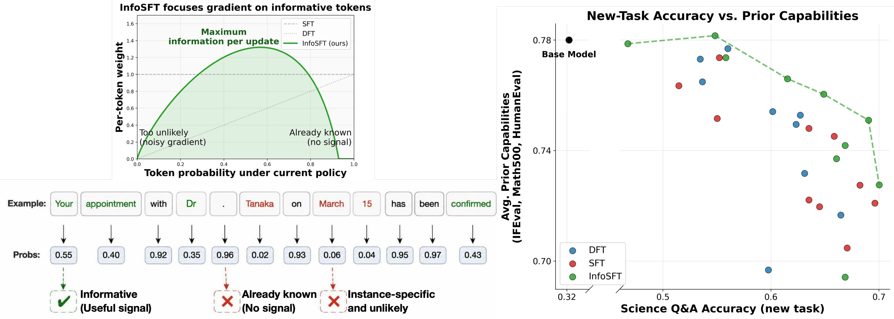

# **InfoSFT: Learn More and Forget Less with Information-Aware Token Weighting**
[](https://arxiv.org/abs/2605.14967)
*InfoSFT is a modification of the standard SFT loss that guarantess better generalization on the new task while forgetting less.*

## Abstract
Supervised fine-tuning (SFT) provides the standard approach for teaching LLMs new behaviors from offline expert demonstrations. However, standard SFT uniformly fits all samples -- including those with low likelihood under the base model -- which can disproportionately drive training updates toward overfitting specific samples rather than learning the target behavior. Moreover, adapting to these unlikely samples induces substantial policy shifts that degrade prior capabilities. Existing methods mitigate this by filtering, regenerating, or down-weighting low-likelihood data. In doing so, they often suppress precisely the novel behaviors the base model has yet to learn. 

We propose InfoSFT, a principled weighting scheme for the SFT objective that concentrates learning signals on maximally informative, medium-confidence tokens -- those neither overly familiar to the base model nor too unlikely to cause instability. Requiring only a one-line modification to the standard token-wise loss, InfoSFT demonstrably improves generalization over vanilla SFT and likelihood-weighted baselines across math, code, and chain-of-thought tasks with diverse model families, while better preserving pre-existing capabilities.



## Getting Started

**Installation:**

```bash
pip install -r requirements.txt
pip install flash-attn==2.7.3 --no-build-isolation
```

> **Note:** `flash-attn` requires `--no-build-isolation` and must be installed separately as shown above.

---

## Training

The InfoSFT loss is implemented in `training/infosft_loss.py` and plugged into TRL's `SFTTrainer` via the `compute_loss_func` argument. All training scripts accept `--loss_type {nll, infosft, dft}` to select between standard SFT, InfoSFT, and DFT baselines.

**Main results** (Table 1) use `training/main_train.py` with two tasks and three model families:

| Script | Task | Dataset | Method |
| :--- | :--- | :--- | :--- |
| `run_numinamath.sh` | Math | NuminaMath-CoT (100k) | Full fine-tuning |
| `run_ultrafeedback.sh` | Code | UltraFeedback code subset (12k) | LoRA |

```bash
# Example: Qwen2.5-Math-7B on NuminaMath with InfoSFT
bash training/scripts/run_numinamath.sh Qwen/Qwen2.5-Math-7B infosft 2e-5

# Example: Llama-3.1-8B on UltraFeedback-Code with DFT
bash training/scripts/run_ultrafeedback.sh meta-llama/Llama-3.1-8B dft 2e-5
```

> **Learning rates:** we use `5e-5` for 1.5B models and `2e-5` for 7B/8B models on math; `2e-5` with `rank=32` for all models on coder.

**Further studies** use separate training scripts:

| Script | Training script | Description |
| :--- | :--- | :--- |
| `run_openR1.sh` | `OpenR1.py` | Qwen2.5-7B-Instruct on OpenR1-Math-220k (2 epochs, long CoT) |
| `run_science.sh` | `Science_Tooluse.py` | Sweep over LR × epochs on science QA |
| `run_tool.sh` | `Science_Tooluse.py` | Sweep over LR × epochs on tool-use |

#### OpenR1 experiment
```bash
bash training/scripts/run_openR1.sh Qwen/Qwen2.5-7B-Instruct infosft 5e-6
```
>This includes the code for using SFT or InfoSFT only. The code must be updated for their combination that runs 1 epoch on each of them

#### Science / Tool-use sweeps (runs all {nll, dft, infosft} and sweeps all hyper-paramters automatically)
```
bash training/scripts/run_science.sh Qwen/Qwen2.5-7B-Instruct data/science_data/train_data
bash training/scripts/run_tool.sh    Qwen/Qwen2.5-7B-Instruct data/tooluse_data/train_data
```

---

## Evaluation

Evaluation scripts are in `eval/` and use [vLLM](https://github.com/vllm-project/vllm) for inference.

**Additional dependencies for evaluation:**

```bash
pip install lm_eval lm_eval[vllm] lm_eval[math] evalplus
```

**Math benchmarks** (MATH-500, AMC, AIME, HMMT, Minerva — acc@1 + pass@k):
```bash
bash eval/run_math_all.sh
```
Edit the `MODELS`, `EXPS`, and `DATASETS` arrays inside the script. Use `--max_tokens 16384` for long-CoT models (e.g., OpenR1).

**Code benchmarks** (HumanEval+, MBPP+ via [EvalPlus](https://github.com/evalplus/evalplus)):
```bash
bash eval/humaneval.sh
```
MultiPL-E evaluation can be found at `eval/multipl-E`.

**Instruction following** (IFEval via [lm-evaluation-harness](https://github.com/EleutherAI/lm-evaluation-harness)):
```bash
bash eval/ifeval.sh
```

**Science QA & Tool-use** (custom evaluations):
```bash
bash eval/Science.sh    # greedy acc@1 on science QA
bash eval/Tooluse.sh    # action + input match on ToolAlpaca
```
Both require preprocessed eval datasets in `data/`. Edit `DATA_PATH`, `MODELS`, and `EXPS` inside each script before running.
